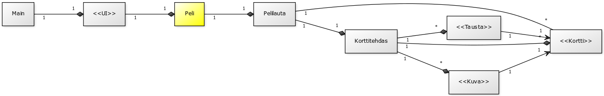

###
**Aihe:** Muistipeli

Toteutetaan yksinkertainen muistipeli, jossa pelaajan tehtävänä on löytää kuvapuoli alaspäin käännetyistä korteista parit. Pelissä on erilaisia vaikeustasoja, ja parhaista pistemääristä (aika, siirrot) pidetään yllä taulukkoa. Tarkoituksena on myös toteuttaa jonkintasoista konfiguroitavuutta, esim. eri korttisarjojen muodossa.

**Käyttäjät:** Pelaaja

**Pelaajan toiminnot:** 

* pelikentän koon valitseminen
* korttisarjan valitseminen
* pelin käynnistäminen
  * pelin pelaaminen
    * kortin klikkaaminen
      * ei onnistu, jos kortti on käännetty tai odotetaan animaation loppua
      * kun kaksi korttia on käännetty, tarkistetaan onko pari
      * jos ei ole pari, odotetaan hetki ja käännetään pari takaisin
      * kun kaikki parit on löydetty, peli loppuu ja siirrytään tulosnäkymään
    * siirtyminen valikkoon

**Luokkakaavio:**

**Rakennekuvaus:**

Pelilogiikka on Peli-luokassa. Peli luo Pelilaudan, Pelilauta luo Korttitehtaan ja Korttitehdas tuottaa halutun tyyppisiä Kortti-olioita. Kortti sisältää Kuvan ja Taustan. UI:n puolelta tulevien käskyjen perusteella Peli kääntää Pelilaudalta haluttuja kortteja, tarkistaa parit ja päivittää Pelitila-enum-muotoista tilamuuttujaa.
Graafiseen käyttöliittymään käytetyn JavaFX:n luonteen vuoksi UI ja pelilogiikka sekoittuvat väkisinkin hieman, mutta koko himmeli kuitenkin tukeutuu Peli-luokkaan.

Palautukseen tehdyssä versiossa kaikki sisältö ml. kuvat, FXML- ja CSS-tiedostot ovat jar-pakkauksen sisällä. Ulkoasu on kuitenkin suunniteltu (suhteellisen) kustomoitavaksi, ja "lopullisemmassa" versiossa nuo varmaankin jätettäisiin pakkauksen ulkopuolelle.

**Sekvenssikaaviot:**

Ensimmäisen kuvan tilanteessa on kutsuttu peli-luokan uusiPeli-metodia oikeilla parametreilla:

Seuraavan kuvan tilanteessa on jo yksi kortti käännetty ja klikataan korttia, joka osoittautuu ensimmäisen pariksi:

